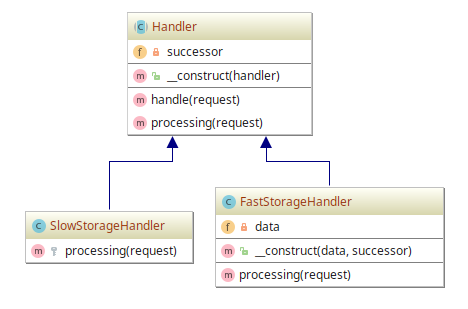

# Chain Of Responsibilities

## Diagram

## Description

A intenção é ter um comportamento em que uma dada request HTTP seja processada
primeira por uma classe de manipulação/tratamento chamada **FastStorageHandler**.
Caso essa classe não consiga processar a request HTTP, repasse a responsabilidade
de processar para uma classe "sucessora" de manipulação/tratamento chamada **SlowStorageHandler**.

## Implementation Methodology

* É especificada uma *Classe Abstrata* chamada `Handler`, responsável por fornecer
um "molde" para que classes de manipulação herdeiras tenham a definição dos métodos
`processing()`, responsável por processar a request HTTP, além de uma implementação 
fixa (isto é, que é imutável) do método `handle()` para manipular o mecanismo de
sucessão, ou seja, de passagem da responsabilidade para uma outra classe herdeira de `Handle`.
    * Entidade: *Classe Abstrata* **Handle** [Handle.php](Handler.php)

* *Zona das classes de manipulação/tratamento*: consiste numa "zona" de definições de classes
herdeiras de `Handle`.
    * Entidades *Classes*:
        * **FastStorageHandler** [FastStorageHandler.php](FastStorageHandler.php)
        * **SlowStorageHandler** [SlowStorageHandler.php](SlowStorageHandler.php)