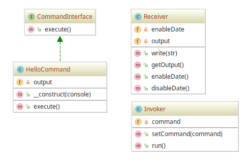

# Command example

## Diagram

## Description

Propõe-se um padrão para execução de um comando que escreva numa lista a frase `Hello World`. Além disso,
deve haver possibilidade de registrar ou não a data atual na execução do comando.

## Implementation Methodology

* É especificada uma *Interface* chamada **CommandInterface**, que define a assinatura do método `execute()`.
Qualquer comando a ser criado precisa implementar a *Interface* **CommandInterface**, sendo o método `execute()`
uma especificação de implementação das tarefas do comando.

  - Entidade: **Interface CommandInterface** [CommandInterface.php](CommandInterface.php)

* Um comando é criado, representado pela *Classe* **HelloCommand** que implementa a *Interface* **CommandInterface**.
Lembrando que uma classe de comando delega as tarefas do comando em si para a classe de receptação `Receiver`.

  - Entidade: **Classe HelloCommand** [HelloCommand.php](HelloCommand.php)

* Uma *Classe* concreta chamada **Receiver** se responsabiliza pelas ações a serem executadas pelos
comandos, guardando o registro dos mesmos numa lista chamada **output**, como exemplo. Somente
as classes de receptação sabem como executar as ações, como `write()`, que escreve um texto na lista.
As ações disponibilizadas são análogas a uma API de baixo nível, que oferece ações básicas a qualquer
outra API que a abstrai.

  É importante ressaltar que qualquer outra classe concreta pode exercer o papel de um receiver.

  - Entidade: **Classe Receiver** [Receiver.php](Receiver.php)

* Uma *Classe* chamada **Invoker** fica responsável por receber uma instância de comando
e disponibilizar o método `run()` que executa o comando `execute()`. Logo, o invocador
não conhece a implementação do comando, apenas chama o método que a conhece.

  - Entidade: **Classe Invoker** [Invoker.php](Invoker.php)