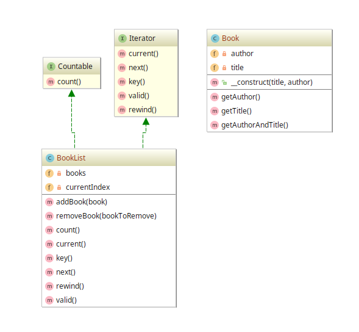

# Iterator example

## Diagram

## Description

A intenção deste padrão é fornecer uma maneira conveniente de tratar um objeto iterável como uma
coleção de objetos. Por padrão, o PHP fornece duas entidades para auxiliar: *Interface* **Countable** e
*Interface* **Iterator**. A exemplo, um objeto do tipo `Book` pode ser criado e armazenado em memória
num `BookList`, que é uma classe que implementa as interfaces **Countable** e **Iterator**.

## Implementation Methodology

* É especificada a *Classe* **Book**, que representa um livro criado.

  - Entidade: **Classe Book** [Book.php](Book.php)

* É especificada a *Classe* **BookList**, que representa a coleção ou lista de livros criados.

  - Entidade: **Classe BookList** [BookList.php](BookList.php)
