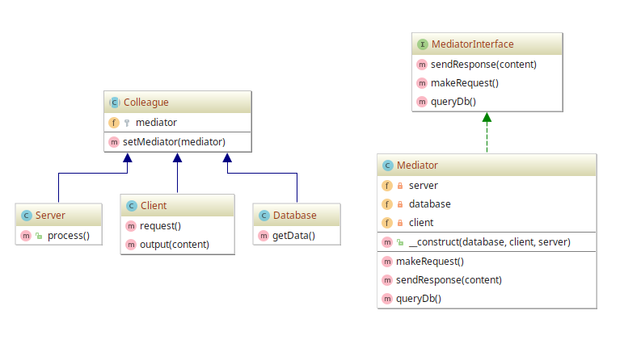

# Mediator example

## Diagram

## Description

A intenção é permitir que componentes (apelidados neste exemplo de "colegas") consigam interagir
mutuamente através de um componente intermediário chamado de *Mediator* (um mediador).

Logo, um "colega" apenas conhece um mediador para que possa pedir por ações que precisam ser feitas
por outros "colegas". Isso evita com que cada componente se comunique com outro de forma a criar regras 
ou condições diferentes causando conflitos de recursos por multiplicidade de relações bilaterais.

São demonstrados 3 componentes, **Client**, **Server** e **Database**, que são tratados como **Colleague**
que precisam conhecer um **Mediator** para que consigam transmitir pedidos de ações mutuamente.

Exemplo: componente **Client** faz um pedido `request()` para o **Mediator** entregá-lo para o **Server**, que,
por sua vez, comunica-se com **Database**. Ao final do pedido, **Server** requisita ao **Mediator** para que
o mesmo envie uma resposta `sendResponse()` para o componente **Client**.

## Implementation Methodology

* É especificada a *Classe Abstrata* **Colleague** para garantir que todo "colega", isto é, componente,
consiga conhecer um **Mediator** para se comunicar com outro componente.

  - Entidade: **Classe Abstrata Colleague** [Colleague.php](Colleague.php)
  
* "Zona dos colegas": são as classes que representam os componentes que poderão se interagir.

  * Entidades **Classes**:
    * **Client** [Client.php](Client.php)
    * **Server** [Server.php](Server.php)
    * **Database** [Database.php](Database.php)

* É especificada uma *Interface* **MediatorInterface** (não obrigatória, mas atende os conceitos do [Princípio 
da Substituição de Liskov](https://en.wikipedia.org/wiki/Liskov_substitution_principle)). Intui-se, com ela, 
garantir que toda implementação de **Mediator** tenha sempre compatibilidade de métodos básicos e primordiais
para que qualquer mediador siga o mesmo "contrato".

  - Entidade: **Interface MediatorInterface** [MediatorInterface.php](MediatorInterface.php)

* Um mediador é implementado pela *Classe* **Mediator**, que por sua vez implementa a *Interface* **MediatorInterface**.
O mediador traz as ações que podem ser solicitadas pelos componentes, além de manter referência a cada
componente e configurá-lo de modo que tome conhecimento do mediador.

  - Entidade: **Classe Mediator** [Mediator.php](Mediator.php)