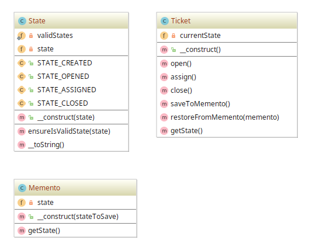

# Memento example

## Diagram

## Description

O objetivo principal deste padrão é prover uma capacidade de restaurar um objeto ao seu estado anterior
(como um *rollback*) ou obter acesso ao seu estado sem revelar sua implementação. Logo, o objeto não necessita
ter um método para retornar seu próprio estado atual.

A exemplo, temos um sistema de emissão de **tickets** (como bilhetes) com 4 estados: **criado** (*created*), 
**aberto** (*opened*), **atribuído** (*assigned*) e **fechado** (*closed*).

Também temos uma entidade responsável, **Ticket**, por criar uma **cópia única** do **estado** do **ticket**, além
de conter o objeto do estado atual.

Por último, temos um **Memento**, uma entidade que representa um *snapshot* (uma imagem) único concreto
do estado do **ticket**. É importante ressaltar que um **memento** é um **clone** e **não** uma **referência** para
um estado do objeto.

## Implementation Methodology

* A *Classe* **State** representa um dos estados possíveis de um **ticket**. São especificados 4 estados:
*created*, *opened*, *assigned* e  *closed*.

  - Entidade: **Classe State** [State.php](State.php)
  
* A *Classe* **Ticket** representa um objeto **ticket** no seu atual estado. Possui os métodos
que alteram o estado atual, que são `create()` (implementado diretamente no construtor), `open()`,
`assign()` e `close()`. Além disso, traz os métodos que permitem obter e carregar o estado de um **ticket**, 
a partir de um **memento**, ou seja, de um *snapshot*: `saveToMemento()` e `restoreFromMemento()`.  

  - Entidade: **Classe Ticket** [Ticket.php](Ticket.php)
  
* A *Classe* **Memento** representa algum estado do objeto **ticket**, ou seja, é uma "imagem" ou *snapshot*
do **ticket**. Vale lembrar que o **memento** é um **clone** do **ticket** e **não** uma **referência** para
um objeto **ticket**.