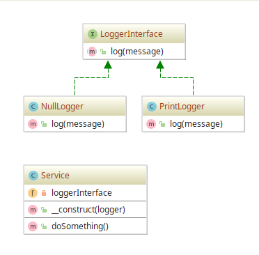

# Null Object example

## Diagram

## Description

A intenção é fornecer um comportamento de uso de um **serviço** que **elimine checagem** para saber, antes de usá-lo,
se o mesmo **conseguiu ser alocado**. Tradicionamente, faz-se com `if (is_null($object)) {...}`. Portanto,
este padrão visa a simplificação ou eliminação dessa etapa.

Para demonstrar, é criado um **serviço** de **logger** que suporte 2 tipos: um logger que não faz nada (**NullLogger**) e outro
que imprime um texto no stdout (**PrintLogger**). Após a especificação dos tipos, o utilizador não precisa
verificar se ambos os serviços foram ou não criados.

## Implementation Methodology

* A *Interface* **LoggerInterface** especifica os métodos que todo **logger** precisa implementar.

  - Entidade: **Interface LoggerInterface** [LoggerInterface.php](LoggerInterface.php)
  
* A *Classe* **NullLogger** implementa um **LoggerInterface** que não tem código útil.

  - Entidade: **Classe NullLogger** [NullLogger.php](NullLogger.php)
  
* A *Classe* **PrintLogger** implementa um **LoggerInterface** que imprime algum texto no stdout.

  - Entidade: **Classe PrintLogger** [PrintLogger.php](PrintLogger.php)