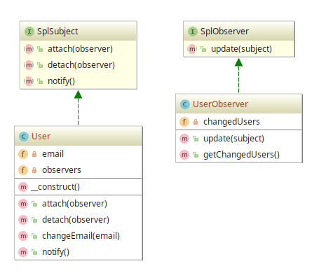

# Observer/Publisher-Subscriber/Event Generator example

## Diagram

## Description

Este padrão tem o objetivo de implementar um comportamento *publish/subscribe* num objeto. Toda vez que um objeto
**Subject** mudar de estado, um **Observer** inscrito será notificado.

> PHP traz 2 Interfaces para auxiliar na implementação: SplSubject e SplObserver.

Como forma de demonstrar a aplicabilidade do conceito do Observer, criamos uma entidade **User** 
que abstrai os dados de um usuário qualquer. Além disso, também criamos uma entidade para
representar um observador chamada **UserObserver**.

Vale ressaltar que **User** pode, neste exemplo, cumprir o papel de um **Subject**, implementando
a Interface **SplSubject**. A entidade **UserObserver** pode cumprir o papel de um **Observer**,
implementando a Interface **SplObserver**.

Sobre a cardinalidade, a entidade **User** pode notificar **N** **UserObserver** enquanto
**UserObserver** pode ter conhecimento de **N** **User**.

Toda vez que ocorrer uma mudança de estado de **User**, como no método `changeEmail()`, uma
notificação é enviada para todos os observadores (**UserObserver**) inscritos com `attach()`.

## Implementation Methodology

* A *Classe* **User** implementa um **Subject**, representado pela *Interface* **SplSubject**.

  - Entidade: **Classe User** [User.php](User.php)
  
* A *Classe* **UserObserver** implementa um **Observer**, representado pela *Interface* **SplObserver**.

  - Entidade: **Classe UserObserver** [UserObserver.php](UserObserver.php)