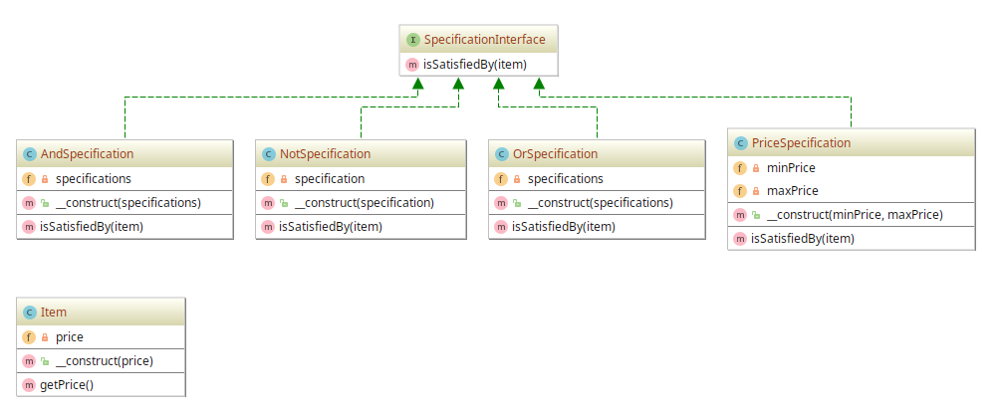

# Specification example

## Diagram

## Description

Este padrão tem o intuito de estabelecer uma **especificação** das **regras de negócio**, em que os objetos
podem ser constantemente checados.

Demonstra-se aqui que classes de especificação têm um método chamado `isSatisfiedBy()` que retorna `true | false`
dependendo se o objeto fornecido satisfaz a especificação.

## Implementation Methodology

* A *Interface* **SpecificationInterface** descreve a assinatura dos métodos que toda classe de **especificação**
deve implementar. O método `isSatisfiedBy()` deve ser implementar um "checador" que atenda às regras de negócio.

  - Entidade: **Interface SpecificationInterface** [SpecificationInterface.php](SpecificationInterface.php)
  
* A *Classe* **AndSpecification** implementa a regra do operador **AND** lógico que obedece a expressão 
`Si` numa sequência conjuntiva `S0 ∧ S1 ∧ S2 ∧ ... ∧ SN`, com i <= N. Cada `Si` corresponde a um Intervalo na 
forma [n1, n2], com n1 e n2 sendo valores do tipo `float`.

  Exemplo: há duas regras para preço de produtos **spec** que variam em preço de acordo com intervalos. 
  Tem-se a regra **spec1** compreendendo o intervalo [50, 100] e **spec2** o intervalo [80, 200].
  
  É criada a especificação de uma regra de negócio que utiliza **AndSpecification**. O método `isSatisfiedBy()`
  irá avaliar "internamente" algo que pode ser expresso como `spec1 ∧ spec2`.
  
  Quando um item (um produto) for criado, pode-se verificar se seu preço satisfaz **spec1** *AND* **spec2**
  <=> `[50, 100] AND [80, 200]`.

  - Entidade: **Classe AndSpecification** [AndSpecification.php](AndSpecification.php)
  
* A *Classe* **OrSpecification** implementa a regra do operador **OR** lógico que obedece a expressão 
`Si` numa sequência disjuntiva `S0 ∨ S1 ∨ S2 ∨ ... ∨ SN`, com i <= N. Cada `Si` corresponde a um Intervalo na 
forma [n1, n2], com n1 e n2 sendo valores do tipo `float`.

  - Entidade: **Classe OrSpecification** [OrSpecification.php](OrSpecification.php)
  
* A *Classe* **NotSpecification** implementa a regra do operador **NOT** lógico que obedece a expressão 
`~S`. A expressão `S` corresponde a avaliação num Intervalo na forma  [n1, n2], com n1 e n2 sendo valores 
do tipo `float`.

  - Entidade: **Classe NotSpecification** [NotSpecification.php](NotSpecification.php)
  
* A *Classe* **PriceSpecification** implementa a regra dos limites intervalares no método
de checagem `isSatisfiedBy()`. Ela estabelece que o preço de um item precisa estar no Intervalo
[n1, n2], com n1 e n2 sendo valores do tipo `float`.

  - Entidade: **Classe PriceSpecification** [PriceSpecification.php](PriceSpecification.php)
  
* A *Classe* **Item** implementa a representação de um produto que tem **preço**.

  - Entidade: **Classe Item** [Item.php](Item.php)