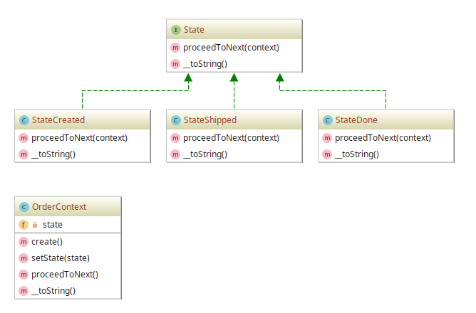

# State example

## Diagram

## Description

Este padrão visa encapsular o comportamento variável para uma mesma rotina com base no estado de um
objeto. Isso pode ser uma maneira mais "limpa" para um objeto alterar seu comportamento em
*runtime* sem recorrer a grandes instruções condicionais monolíticas.

A exemplo, foi sugerida uma aplicação que provê processos básicos de pedidos de compra de produtos, como
acontece num e-commerce. Chamamos o contexto dos processos dos pedidos de **OrderContext**.

Há basicamente 3 processos na sequência:

**StateCreated** (Pedido Criado) --> **StateShipped** (Produto Enviado) --> **StateDone** (Finalização do processo)

## Implementation Methodology

* A *Interface* **State** especifica os métodos que toda classe que representa um estado do
contexto de um **pedido** deve implementar. É importante ressaltar que o método `proceedToNext()`
representa a ação de se passar para o próximo estado no processo do pedido.

  - Entidade: **Interface State** [State.php](State.php)
  
* A *Classe* **StateCreated** implementa a interface **State**, representando o estado concreto de
**criação do pedido**. Aqui é implementado `proceedToNext()` para proceder para o estado **StateShipped**.

  - Entidade: **Classe StateCreated** [StateCreated.php](StateCreated.php)

* A *Classe* **StateShipped** implementa a interface **State**, representando o estado concreto de
**envio do pedido/produto**. Aqui é implementado `proceedToNext()` para proceder para o estado **StateDone**.

  - Entidade: **Classe StateShipped** [StateShipped.php](StateShipped.php)

* A *Classe* **StateDone** implementa a interface **State**, representando o estado concreto de
**finalização do pedido/produto**. Aqui é implementado `proceedToNext()` para proceder para **nenhum estado**.

  - Entidade: **Classe StateDone** [StateDone.php](StateDone.php)

* A *Classe* **OrderContext** implementa um "coordenador" de contexto dos **pedidos**. Ela implementa
o método estático `create()` para iniciar o processo de compra, além de ser resposável por interagir
com o método `proceedToNext()` dos estados.
 
  - Entidade: **Classe OrderContext** [OrderContext.php](OrderContext.php)