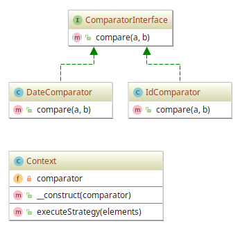

# Strategy example

## Diagram

## Description

Este padrão tem o objetivo de separar estratégias e permitir rápida troca entre elas.
Também é uma boa alternativa à herança (ao invés de ter uma classe abstrata que é estendida).

Para demonstrar alguma aplicabilidade, o cenário é o seguinte: temos uma lista de **IDs** e outra de
**Datas**, ambas numa ordem aleatória. A ideia é criar uma maneira de ordenar as duas listas
utilizando as estratégias de **comparação** de **data** para uma lista de data e de **números** para
uma lista numérica. O importante, aqui, não é somente a forma de ordenar, mas a facilidade para
trocar a estratégia num contexto.

## Implementation Methodology

* A *Interface* **ComparatorInterface** especifica a assinatura dos métodos relativos a alguma 
estratégia de comparação de entidades, podendo ser números, datas e etc.

  - Entidade: **Interface ComparatorInterface** [ComparatorInterface.php](ComparatorInterface.php)

* A *Classe* **DateComparator** implementa a interface **ComparatorInterface** para um
comparador baseado em **datas** (Classe **DateTime** padrão em PHP).

  - Entidade: **Classe DateComparator** [DateComparator.php](DateComparator.php)

* A *Classe* **IdComparator** implementa a interface **ComparatorInterface** para um
comparador baseado em **números** (Classe **DateTime** padrão em PHP).

  - Entidade: **Classe IdComparator** [IdComparator.php](IdComparator.php)

* A *Classe* **Context** especifica a implementação de um **contexto** de aplicação de 
**estratégias de ordenação** baseadas na interface **ComparatorInterface**.

  - Entidade: **Classe Context** [Context.php](Context.php)