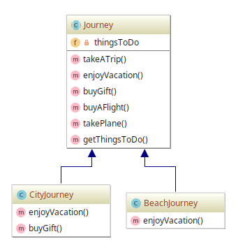

# Template Method example

## Diagram

## Description

A ideia é deixar que subclasses de um modelo abstrato "terminem" o comportamento de um algoritmo.

### Princípio de Hollywood

*"Não nos chame. Nós chamamos você."*.

Este princípio pode significar que uma classe pai não é chamada por suas subclasses, mas o contrário, 
devendo a classe pai chamar as subclasses.

Em outras palavras, este padrão é um "molde" de um algoritmo. O principal cenário de uso é em
bibliotecas de frameworks. O usuário das bibliotecas tem que apenas implementar um método
e a superclasse faz o trabalho restante. Ou seja, o usuário apenas se dedica ao trabalho
especializado.

## Implementation Methodology

* A *Classe Abstrata* **Journey** define que toda **viagem** deve detalhar **como as férias
devem ser aproveitas** no método `enjoyVacation()`. Também estabelece que é possível, no trajeto
da viagem, comprar ou não um presente com o método `buyGift()`. Além disso, define a forma que
toda viagem **DEVE** ter de **comprar um voo** (`buyAFlight()`) e **pegar o avião** (`takePlane()`).

  Podemos sintetizar a **viagem** nos seguintes passos, implementados no método `takeATrip()`:
  
  1. Comprar um voo (`buyAFlight()`);
  2. Pegar o avião (`takePlane`);
  3. Aproveitar as férias (`enjoyVacation()`);
  4. Comprar ou não um presente (`buyGift()`);
  5. Pegar o avião novamente (`takePlane()`).
  
  - Entidade: **Classe Abstrata Journey** [Journey.php](Journey.php)

* A *Classe* **BeachJourney** estende a classe abstrata **Journey**, especificando uma **viagem
à praia** e como ela pode ser aproveitada pelo método `enjoyVacation()`.
  
  - Entidade: **Classe BeachJourney** [BeachJourney.php](BeachJourney.php)

* A *Classe* **CityJourney** estende a classe abstrata **Journey**, especificando uma **viagem
à uma cidade**, como ela pode ser aproveitada pelo método `enjoyVacation()` e que no trajeto
um **presente será comprado** com o método `buyGift()`.
  
  - Entidade: **Classe CityJourney** [CityJourney.php](CityJourney.php)