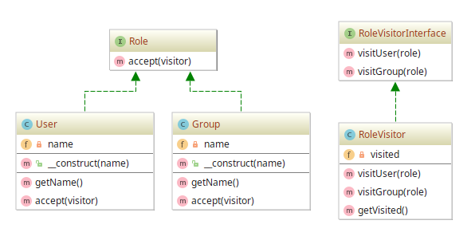

# Visitor example

## Diagram

## Description

A principal ideia por trás deste padrão é poder **terceirizar um comportamento** num objeto
por meio de outro objeto. Um objeto **visitor** permite que **operações adicionais** sejam
criadas **sem** que haja **necessidade** de **mudar** a **classe** que contém os **elementos** operados.

Como um exemplo prático, podemos modelar uma aplicação que possua diretrizes e permissões de acesso
dados por meio de **Roles**. Uma **role** é um *papel* a ser cumprido, sendo sugerido a de **User** 
e **Group**. 

Toda entidade que implementar um contrato de **Role** deverá detalhar o comportamento para **aceitar** 
a adição de um comportamento terceirizado por um **visitor**. Mais precisamente, o método de **aceitar**
consiste em chamar um método de algum **visitor** que, por sua vez, receberá o própria entidade
chamadora, sendo neste caso alguma entidade que implementa **Role**.

E por fim, também é descrita uma entidade que atua como um **visitor**, como **RoleVisitor**, 
que possui os métodos que podem manipular e acrescentar funcionalidades extras às entidades
que atuam como **roles**.

## Implementation Methodology

* A *Interface* **Role** especifica um contrato que toda entidade implementadora precisa cumprir
para ser considerada uma **role**. Vale destacar que a assinatura `accept(visitor)` define que
toda entidade que atua como **role** precisa **aceitar** que um comportamento será terceirizado
a partir de um **visitor**.
  
  - Entidade: **Interface Role** [Role.php](Role.php)
  
* A *Classe* **User** implementa uma **Role**. Além disso, especifica que o método `accept(visitor)`
chamará um método "terceirizado" que reside num **RoleVisitor**, `visitUser($this)`.
  
  - Entidade: **Classe User** [User.php](User.php)
  
* A *Classe* **Group** implementa uma **Role**. Além disso, especifica que o método `accept(visitor)`
chamará um método "terceirizado" que reside num **RoleVisitor**, `visitGroup($this)`.
  
  - Entidade: **Classe Group** [Group.php](Group.php)
  
* A *Interface* **RoleVisitorInterface** especifica um contrato para que toda entidade implementadora
garanta que métodos "terceirizados" sejam implementados para cada entidade-alvo de adição/terceirização,
sendo `visitUser(role)` e `visitGroup(role)`.
  
  - Entidade: **Interface RoleVisitorInterface** [RoleVisitorInterface.php](RoleVisitorInterface.php)
  
* A *Classe* **RoleVisitor** implementa um **visitor** baseado na interface **RoleVisitorInterface**.
Aqui há especialização de funcionalidades para cada entidade-alvo: **User** (por meio do método
`visitUser(user)`) e **Group** (por meio do método `visitGroup(group)`).
  
  - Entidade: **Classe RoleVisitor** [RoleVisitor.php](RoleVisitor.php)