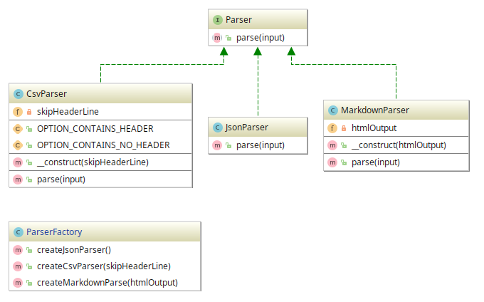

# AbstractFactory example

## Diagram

## Description

A intenção é termos uma forma de fazer análise sintática com diversos Parsers.
Os parsers disponíveis devem analisar **CSV**, **JSON** e **Markdown** simples.

## Implementation Methodology

* É especificado um *Interface* chamado **Parser**, que define a assinatura do método `parse($input)`.
  - Entidade : **Interface Parser** [`Parser.php`](Parser.php)

* "Zona dos parsers": consiste nas classes que implementam a *Interface* **Parser**. Isto é,
são classes que concretizam o contrato determinado para um tipo de parser.
  * Entidades **Classes**:
    * **CsvParser** [CsvParser.php](CsvParser.php)
    * **JsonParser** [JsonParser.php](JsonParser.php)
    * **MarkdownParser** [MarkdownParser.php](MarkdownParser.php)
    
* Fábrica de Parsers: é uma classe que contém métodos que se responsabilizam pela instanciação
de cada um dos parsers especificado nas classes da "Zona de parsers".

  * Entidade: **Classe ParserFactory** [ParserFactory.php](ParserFactory.php)