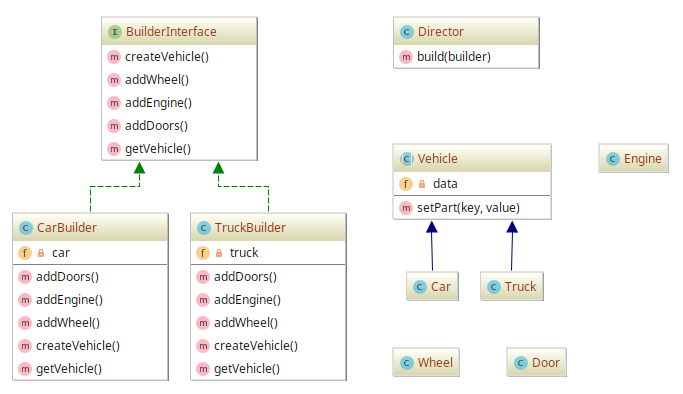

# Builder

## Diagram

## Description

A intenção é termos uma forma de construir uma representação lógica de um **veículo**, como um carro e caminhão,
através de um componente **diretor** que será instruído do método de construção, que se pode chamar de *Builder*.

## Implementation Methodology

* Tem-se a definição de um **diretor**: é uma classe encarregada de construir a representação lógica
de um **veículo**, instruída por alguma classe que implementa a *Interface* **BuildInterface**, isto é,
uma forma de construir o veículo.
    * Entidade: **Classe Director** [Director.php](Director.php)

* Define-se uma *Interface* **BuilderInterface**, responsável por garantir que classes de construção
de veículo implementem métodos que se encarregam de criar e montar um veículo mais "concreto".
    * Entidade: **Interface BuilderInterface** [BuilderInterface.php](BuilderInterface.php)

* "Zona dos Builders": consiste nas classes que irão implementar a interface de construção de algum veículo,
**BuilderInterface**.

  * Entidades **Classes**:
    * **CarBuilder** [CarBuilder.php](CarBuilder.php)
    * **TruckBuilder** [TruckBuilder.php](TruckBuilder.php)

* "Zona das Partes/Componentes": consiste nas classes que representam logicamente peças e veículos concretos, como
carro e caminhão.
  * Entidade: **Classe Abstrata Vehicle** [Parts/Vehicle.php](Parts/Vehicle.php):
  * Entidades **Classes**:
    * **Car** [Parts/Car.php](Parts/Car.php)
    * **Truck** [Parts/Truck.php](Parts/Truck.php)
    * **Door** [Parts/Door.php](Parts/Door.php)
    * **Wheel** [Parts/Wheel.php](Parts/Wheel.php)
    * **Engine** [Parts/Engine.php](Parts/Engine.php)