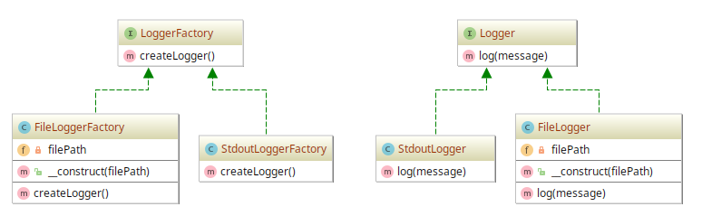

# FactoryMethod example

## Diagram

## Description

A intenção é fornecer uma maneira simples de possibilitar a criação de mecanismos de registro
de logs, chamados de *Loggers*. A exemplo, demonstra-se a criação de um mecanismo que registra
logs no *stdout* e outro em *arquivo* no *filesystem*.
 
## Implementation Methodology

* A *Interface* **Logger** define métodos para que classes implementadoras de loggers especifiquem
implementações, como o método `log(message)`, que pode trazer tarefas que escrevem mensagens de texto
no *stdout* ou em arquivo.

  - Entidade: **Interface Logger** [Logger.php](Logger.php)

* A *Classe* **StdoutLogger** implementa um logger baseado na *Interface* **Logger**. Traz a implementação
do método `log(message)` que escreve uma mensagem no *stdout*.

  - Entidade: **Classe StdoutLogger** [StdoutLogger.php](StdoutLogger.php)
  
* A *Classe* **FileLogger** implementa um logger baseado na *Interface* **Logger**. Traz a implementação
do método `log(message)` que escreve uma mensagem num arquivo especificado pelo desenvolvedor.

  - Entidade: **Classe FileLogger** [FileLogger.php](FileLogger.php)

* A "fábrica de loggers" tem sua *Interface* especificada por **LoggerFactory**. Traz a assinatura
de um método chamado `createLogger()` que retorna um objeto do tipo **Logger**, isto é, alguma instância
baseada em **StdoutLogger** ou **FileLogger**, por exemplo.

  - Entidade: **Classe LoggerFactory** [LoggerFactory.php](LoggerFactory.php)

* A *Classe* **StdoutLoggerFactory** implementa uma "fábrica de logger" baseada na *Interface* **LoggerFactory**.
Logo, é obrigada a implementar o método `createLogger()`, que por sua vez retorna um objeto do tipo **StdoutLogger**.

  - Entidade: **Classe StdoutLoggerFactory** [StdoutLoggerFactory.php](StdoutLoggerFactory.php)

* A *Classe* **FileLoggerFactory** implementa uma "fábrica de logger" baseada na *Interface* **LoggerFactory**.
Logo, é obrigada a implementar o método `createLogger()`, que por sua vez retorna um objeto do tipo **FileLogger**.

  - Entidade: **Classe FileLoggerFactory** [FileLoggerFactory.php](FileLoggerFactory.php)