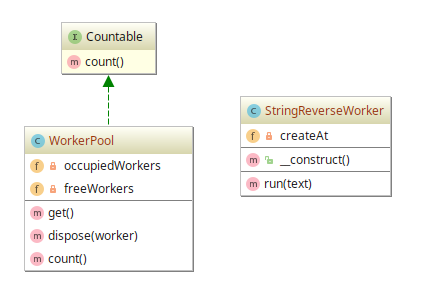

# Pool example

## Diagram

## Description

O objetivo deste padrão é estabelecer um conjunto de objetos (*Pool*) que se encarrega de inicializá-los
para permitir operações nos mesmos. Após o uso dos objetos criados, eles não são automaticamente destruídos.
Pelo contrário, são transferidos para um conjunto de objetos "livres" para que possam ser reutilizados caso
preciso.

O padrão *Pool* é uma boa forma de se **reduzir instanciação de classes** que possuam **muitas etapas de
inicialização**, como **conexões** com **Banco de Dados**, **sockets**, **objetos gráficos grandes** (carregamento de mídias) e etc.
No entanto, um *Pool* com objetos de carregamento menos dependentes de entidades externas pode não ter
bom desempenho, somente ocupando mais memória.
 
## Implementation Methodology

* É especificada uma *Classe* chamada **StringReverseWorker**, responsável por fornecer um método
de reversão de texto em `run()`, além de ter o registro da data de instanciação da classe no seu
construtor.

  - Entidade: **Classe StringReverseWorker** [StringReverseWorker.php](StringReverseWorker.php)

* É especificada uma *Classe* chamada **WorkerPool**, responsável por oferecer um método para criação das
instâncias de classe (`get()`), guardando os objetos "workers" numa lista de recursos ocupados (`$occupiedWorkers`). Além disso,
é oferecido o método `dispose()` para transferir o objeto "worker" para a lista de recursos desocupados (`$freeWorkers`).

  - Entidade: **Classe WorkerPool** [WorkerPool.php](WorkerPool.php)