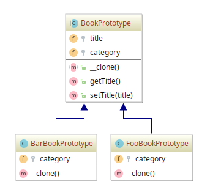

# Prototype example

## Diagram

## Description

A intenção deste padrão é evitar o custo da criação tradicional de objetos (uso do operador `new`). Para tanto,
um protótipo é criado e serão feitos clones do mesmo.

Como demonstração, consideremos uma entidade chamada **BookPrototype**, que garante que todo protótipo
estendido possua os campos de uma entidade *Book* não evidentemente expressa, possuindo os 
campos **título** e **categoria**. Também especifica a assinatura do método de clonagem padrão `__clone()`.

Há duas classes que implementam um **protótipo** de *Book*, isto é, **BookPrototype**: 

- **FooBookPrototype**: implementa o método de clonagem padrão `__clone()`, apesar de não possuir nenhuma tarefa a mais;
- **BarBookPrototype**: idem ao **FooBookPrototype**;

## Implementation Methodology

* A *Classe Abstrata* **BookPrototype** garante que todo protótipo consiga manter as propriedades padrões 
(como `title` e `category`) de uma entidade *Book* não expressa, além de deixar claro que todo protótipo
implemente o método `__clone()`, mesmo que não haja nenhuma tarefa adicional.

  - Entidade: **Classe Abstrata BookPrototype** [BookPrototype.php](BookPrototype.php)

* "Zona dos protótipos de Book": são as classes que trazem uma implementação de um protótipo de *Book*, estendendo
a classe abstrata **BookPrototype**:

  * Entidades **Classes**:
      * **FooBook** [FooBookPrototype.php](FooBookPrototype.php)
      * **BarBook** [BarBookPrototype.php](BarBookPrototype.php)