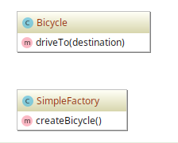

# Simple Factory example

## Diagram

## Description

A intenção é fornecer uma maneira muito simples de permitir a criação de fábricas de objetos
sem uso de métodos estáticos, como ocorre no padrão *Static Factory*. É mais recomendável fazer
uso deste padrão.

A exemplo, é demonstrada a criação de uma fábrica de veículos, como de bicicleta.

## Implementation Methodology

* A *Classe* **SimpleFactory** implementa o método para criação de uma bicicleta, `createBicycle()`.

  - Entidade: **Classe SimpleFactory** [SimpleFactory.php](SimpleFactory.php)

* A *Classe* **Bicycle** representa a uma bicicleta.

  - Entidade: **Classe Bicycle** [Bicycle.php](Bicycle.php)
