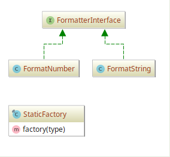

# Static Factory example

## Diagram

## Description

É similar ao padrão **Abstract Factory**, exceto por usar apenas 1 método estático para criar todo tipo
de objeto que pode ser criado. Este método usualmente é chamado de `factory()` ou `build()`.

A exemplo, é demonstrada a criação de uma fábrica de "formatadores de dados".

> Não se recomenda utilizar este padrão para implementar fábrica de objetos. Devido as dificuldades
em lidar com testes e pouca flexibilidade, recomenda-se o Abstract Factory, Factory Method, Builder ou 
Simple Factory.

## Implementation Methodology

* A *Interface* **FormatterInterface** expressa a Interface de um "formatador".

  - Entidade: **Interface FormatterInterface** [FormatterInterface.php](FormatterInterface.php)

* A *Classe* **FormatNumber** implementa "formatador" para números.

  - Entidade: **Classe FormatNumber** [FormatNumber.php](FormatNumber.php)

* A *Classe* **FormatString** implementa "formatador" para textos.

  - Entidade: **Classe FormatString** [FormatString.php](FormatString.php)

* A *Classe* **StaticFactory** implementa o método estático `factory()` que retorna os "formatadores"
pedidos por parâmetro.

  - Entidade: **Classe StaticFactory** [StaticFactory.php](StaticFactory.php)