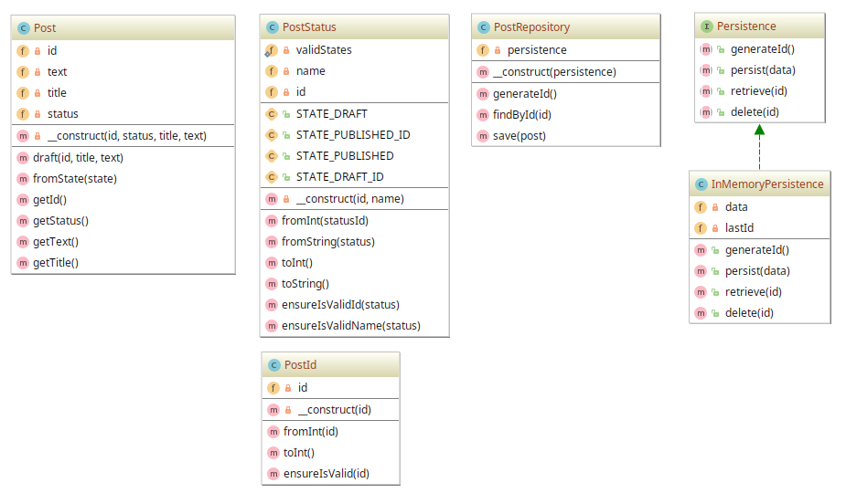

# Repository example

## Diagram

## Description

O padrão **Repository** é um dos mais populares implementados em frameworks. Ele estabelece um **mediador**
de entidades de **Domínio** e as camadas de acesso a dados (*Data Access Layer* ou **DAL**).

O repositório encapsula o conjunto de objetos persistidos num local de armazenamento (*data store*)
e as operações executadas sobre eles, fornecendo uma visão mais orientada a objetos da camada de persistência.

Também objetiva separar de forma limpa e estabelecer um relacionamento uniderecional entre **Domínio** e **DAL**.

Um exemplo muito próximo ao real é demonstrado aqui. ...

## Implementation Methodology

### Domain

* A *Classe* **Post** ....

  - Entidade: **Classe Post** [Domain/Post.php](Domain/Post.php)

### Repository

...

### DAL (or DAO)