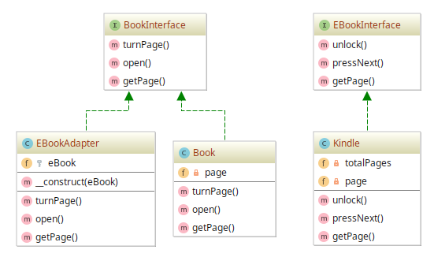

# Adaptar/Wrapper example

## Diagram

## Description

A intenção é possibilitar a operação de um dispositivo de leitura, como o Kindle, utilizando
uma interface de comunicação de um livro comum (chamado "ideal").

Considere que um **livro comum** possibilite as seguintes ações:

* **Turn Page** (virar página);
* **Get Page** (obter número da página atual de leitura);
* **Open** (abrir o livro).

Num dispositivo de leitura como o Kindle, teremos as seguintes ações comuns a todo dispositivo
de leitura (**ebook**) e suas correspondências:

* **Next Page** (que podemos interpretar como **Turn Page**);
* **Get Page** (equivalente a **Get Page** de um livro comum);
* **Unlock** (podemos interpretar como **Open**).

## Implementation Methodology

* É especificado a Interface `BookInterface` para que classes que implementem se comprometam
a implementar ações comuns a todo livro "comum" ou "ideal".
    - Entidade: *Interface* **BookInterface** [BookInterface.php](BookInterface.php)
    
* Temos a Interface `EBookInterface` que determinam a assinatura de métodos comuns a todo
dispositivo de leitura eletrônico, como o Kindle.
    - Entidade: *Interface* **EBookInterface** [EBookInterface.php](EBookInterface.php)
    
* Definimos um **Adapter** como sendo a classe `EBookAdapter`, responsável por traduzir
ações de um livro comum, implementados com base na Interface `BookInterface`, em ações
mais "concretas" de um dispositivo eletrônico de leitura, baseadas em classes que implementam
a Interface `EBookInterface`.
    - Entidade: *Classe* `EBookAdapter` [EBookAdapter.php](EBookAdapter.php)
    - Dica de nome do Adapter: traduza "Adaptador para um \<Alvo\>" para "\<Alvo\>Adapter"
    
    - Esquemático: **EBookAdapter** *implementa* **BookInterface** e *traduz* para **EBookInterface**

* Definimos uma classe de um livro comum chamada `Book` que implementa ações da Interface `BookInterface`.
    - Entidade: *Classe* `Book` [Book.php](Book.php)
    
* Por último, temos uma classe de um `Kindle`, um dispositivo de leitura que implementa ações da Interface
`EBookInterface`.
    - Entidade: *Classe* `Kindle` [Kindle.php](Kindle.php)