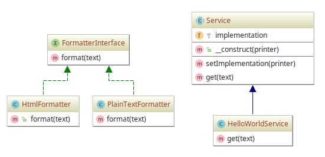

# Bridge

## Diagram

## Description

A intenção é ter uma maneira que facilite a criação de um serviço que possibilite
duas formas de implementação de um formatador de texto: um que use texto puro (*plain text*) e
outro que use HTML. Também deve ser possível trocar a implementação de formatação de texto de 
maneira simples.

## Implementation Methodology

* É especificada a *Classe Abstrata* `Service`, que garante que classes implementadoras de algum serviço
tenham métodos que especifiquem a configuração de um implementador (método `setImplementation()`), além de 
métodos tarefas fornecidas por um implementador qualquer (método `get()`).

  * Entidade: *Classe Abstrata* **Service** [Service.php](Service.php)
    
* A exemplo, é fornecida uma *Classe* **HelloWorldService**, que é um serviço hipotético particular
que oferece uma tarefa para interagir com método de formatação de texto de algum implementador.

  * Entidade: *Classe* **HelloWorldService** [HelloWorldService.php](HelloWorldService.php)
    
* É especificada a *Interface* **FormatterInterface**, que garante que classes implementem algum método
para formatação de texto. Há uma assinatura para tornar obrigatório a implementação do método `format(text)`.

  * Entidade: *Interface* **FormatterInterface** [FormatterInterface.php](FormatterInterface.php)
    
* "Zona de formatadores de texto": consiste de classes que especificam alguma forma de formatação de texto,
seja através de texto puro ou HTML.

  * Entidades *Classes*:
    * **PlainTextFormatter** [PlainTextFormatter.php](PlainTextFormatter.php)
    * **HtmlFormatter** [HtmlFormatter.php](HtmlFormatter.php)