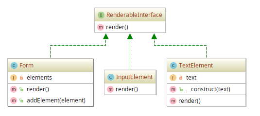

# Composite example

## Diagram

## Description

A intenção é fornecer uma estrutura lógica que permita com que um formulário em HTML
e dois componentes, um de `<input type="text"/>` e outro de texto puro, sejam renderizados.
Uma hierarquia é fornecida e, com um mesmo método, renderiza-se todos os componentes da árvore
de componentes criada.

## Implementation Methodology

* Uma *Interface* chamada **RenderableInterface** especifica a assinatura do método `render()` que obriga
com que todas as classes de componentes renderizáveis façam a implementação de tarefas para renderizar
o componente/elemento.

  - Entidade: **Interface RenderableInterface** [RenderableInterface.php](RenderableInterface.php)

* É especificada a *Classe* **Form** que implementa a *Interface* **RenderableInterface**. Ela, além
de trazer um método para adicionar elementos à uma estrutura de lista chamado `addElement(element)`,
também traz o renderizador dos componentes adicionados à lista de elementos `elements`. Para cada
elemento inserido, essa classe chama o método `render()` do elemento adicionado.

  - Entidade: **Classe Form** [Form.php](Form.php)

* A *Classe* **InputElement** carrega a implementação de um componente HTML `<input type="text"/>`. Ela
se baseia na *Interface* **RenderableInterface**.

  - Entidade: **Classe InputElement** [InputElement.php](InputElement.php)
  
* A *Classe* **TextElement** carrega a implementação de um componente de texto puro. Ela
se baseia na *Interface* **RenderableInterface**.

  - Entidade: **Classe TextElement** [TextElement.php](TextElement.php)