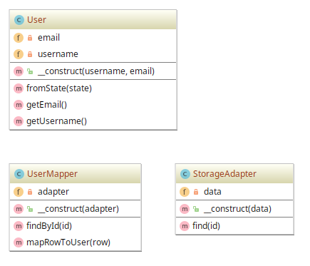

# Composite example

## Diagram

## Description

A intenção é fornecer uma abstração e independência da representação em memória de um objeto **User**
de sua representação de persistência de armazenamento (como num Banco de Dados). Uma *Classe* chamada 
**UserMapper** exerce o papel de um *Data Access Layer* ou mais especificamente de um 
*Data Access Objects* (*DAO*), servindo de "ponte" entre a **representação em memória (domínio)**
e o **local de armazenamento** (que pode ser um **Banco de Dados**). O local de armazenamento é representado
pela *Classe* **StorageAdapter**.

## Implementation Methodology

* A *Classe* **User** representa os dados de um usuário qualquer, que tem `username` e `email`.

  - Entidade: **Classe User** [User.php](User.php)

* A *Classe* **UserMapper** representa o **DAO**, isto é, a camada que fornece a ponte que liga
a representação em memória de **User** à representação num local de armazenamento, provido pela
classe **StorageAdapter**.

  - Entidade: **Classe UserMapper** [UserMapper.php](UserMapper.php)

* A *Classe* **StorageAdapter** representa os dados armazenados num local de persistência. Observa-se
que aqui não se particulariza a origem, mas somente o mecanismo ou o meio no qual se persiste dados.
Este adapter pode, futuramente, abstrar o acesso e operações de um Banco de Dados relacional particular, 
por exemplo.

  - Entidade: **Classe StorageAdapter** [StorageAdapter.php](StorageAdapter.php)