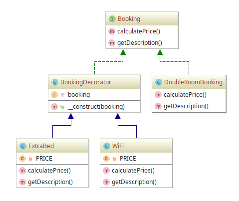

# Decorator example

## Diagram

## Description

A intenção deste padrão é permitir uma estrutura que facilita a adição de novas funcionalidades a
instâncias já criadas.

Inicialmente, temos um caso de implementação do conceito de **reserva** (`booking`). Na reserva de um serviço
de hotel, por exemplo, é possível escolher o serviço de **quarto de casal** (`double room`) nas modalidades
ou **opções de serviço**: com uma cama extra e/ou Wifi. Cada opção acrescentada tem preço e descrição que
precisam ser calculados juntamente com o serviço de **quarto de casal**.

## Implementation Methodology

* Uma *Interface* chamada **Booking** especifica o que toda **reversa** precisa ser capaz de fazer: ter um método
de cálculo do preço (`calculatePrice()`), além de um método para obter a descrição do serviço (`getDescription()`).

  - Entidade: *Interface* **Booking** [Booking.php](Booking.php)
    
* Uma *Classe* chamada **DoubleRoomBooking** representa a implementação de um serviço de **reserva** baseado na
*Interface* **Booking**. Este serviço oferece a opção de reserva de **quarto de casal**, com seu preço (`PRICE`) e
descrição específica.

  - Entidade: *Classe* **DoubleRoomBooking** [DoubleRoomBooking.php](DoubleRoomBooking.php)
  
* Uma *Classe Abstrata* chamada **BookingDecorator** especifica a assinatura e implementação de um construtor
que garanta que toda **opção de serviço** acrescentada consiga interagir com o serviço de **reserva** (`booking`).

  - Entidade: *Classe Abstrata* **BookingDecorator** [BookingDecorator.php](BookingDecorator.php)
  
* A *Classe* **ExtraBed** implementa uma **opção de serviço** que acrescenta uma cama extra à **reserva** (`booking`).
Ela define o preço do custo dessa opção somada ao valor do serviço de **reserva** já escolhido, além
de adicionar um texto detalhando o serviço escolhido à descrição do serviço de **reserva**.

  - Entidade: *Classe* **ExtraBed** [ExtraBed.php](ExtraBed.php)
  
* A *Classe* **WiFi** implementa uma **opção de serviço** que acrescenta o acesso ao WiFi à **reserva** (`booking`).
Ela define o preço do custo dessa opção somada ao valor do serviço de **reserva** já escolhido, além
de adicionar um texto detalhando o serviço escolhido à descrição do serviço de **reserva**.

  - Entidade: *Classe* **WiFi** [WiFi.php](WiFi.php)