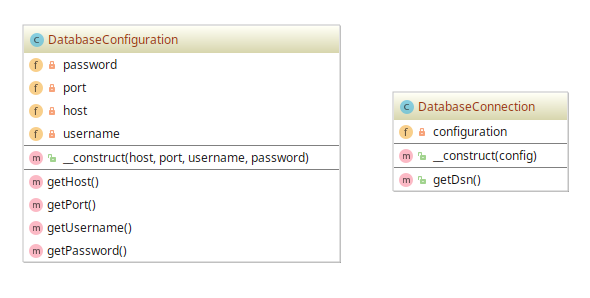

# Dependency Injection example

## Diagram

## Description

Intui-se com este exemplo de padrão a implementação de uma arquitetura fracamente acoplada
para obter código testável, manutenível e extensível.

Uma demonstração da aplicação deste padrão é numa aplicação que utiliza uma conexão com algum **Banco de Dados**.
Há geralmente as entidades **DatabaseConfiguration** (representa os dados de configuração de uma conexão 
de rede com o Banco de Dados) e **DatabaseConnection** (representa a conexão de rede ao Banco de Dados).

Para se comunicar com o Banco de Dados, utilizando-se este padrão, faz-se necessária a **injeção**, isto é,
a passagem como parâmetro ao construtor de **DatabaseConnection** um objeto do tipo **DatabaseConfiguration**.

## Implementation Methodology

* A *Classe* **DatabaseConfiguration** especifica a implementação da entidade de configuração a um Banco de Dados.

  - Entidade: **Classe DatabaseConfiguration** [DatabaseConfiguration.php](DatabaseConfiguration.php)

* A *Classe* **DatabaseConnection** especifica a implementação da conexão de rede a um Banco de Dados. Ela não
permite que se especifique diretamente os dados de configuração da conexão, mas permite que se **injete**
um objeto do tipo **DatabaseConfiguration**. A *injeção de dependência* se dá com a passagem do **objeto de
configuração** no _construtor_ da **classe de conexão**.

  - Entidade: **Classe DatabaseConnection** [DatabaseConnection.php](DatabaseConnection.php)