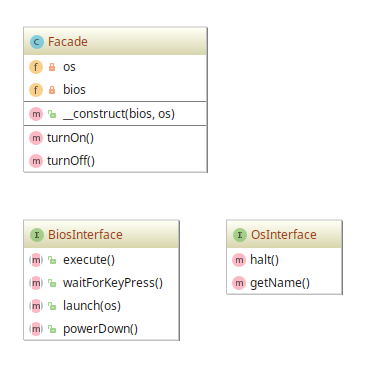

# Facade example

## Diagram

## Description

Este padrão visa o desacoplamento do cliente a um subsistema incorporando muitas (ou apenas uma) **interface** e,
é claro, reduzir a complexidade. O princípio atendido neste padrão é observado pela **Lei de Demeter** 
(popularmente conhecida pela frase *"Não converse com estranhos!"*).

Como exemplo, temos um simulador conceitual de um sistema computacional composto de dois componentes:
**BIOS** e **OS** (**Operating System**). Há uma "fachada" chamada genericamente de **Facade** que
fornece os métodos para **ligar o sistema** (`turnOn()`) e **desligar o sistema** (`turnOff()`).
Como sabemos, nos dois métodos há tarefas a serem orquestradas em cada componente do sistema computacional.

## Implementation Methodology

* Uma *Interface* chamada **BiosInterface** especifica a assinatura dos métodos que todo componente de **BIOS**
precisa implementar.

  - Entidade: *Interface* **BiosInterface** [BiosInterface.php](BiosInterface.php)
    
* Uma *Interface* chamada **OsInterface** especifica a assinatura dos métodos que todo componente de **OS**
precisa implementar.

  - Entidade: *Interface* **OsInterface** [OsInterface.php](OsInterface.php)
    
* Uma *Classe* chamada **Facade** especifica a implementação da "fachada" a um **sistema computacional**
que orquestra **BIOS** e **OS**.

  - Entidade: *Classe* **Facade** [Facade.php](Facade.php)