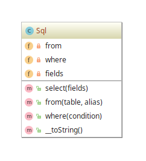

# Fluent Interface example

## Diagram

## Description

Propõe-se oferecer uma estrutura de código que permita que se leia instruções de forma parecida
às sentenças em linguagem natural (em inglês).

## Implementation Methodology

* A *Classe* **Sql** fornece os métodos que retornam o próprio objeto **Sql**, possibilitando
a concatenação de forma que sentenças se formem com o nome dos métodos chamados.

  - Entidade: *Classe* **Sql** [Sql.php](Sql.php)