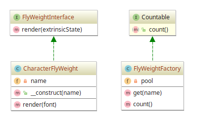

# Flyweight example

## Diagram

## Description

Este padrão visa minimizar o uso de memória se valendo da similaridade dos estados dos objetos.
Uma prática comum é manter o estado em estruturas de dados externas e passá-las ao objeto
**flyweight** quando necessário.

Para demonstrar, é implementado um "renderizador" de fonte baseado em caracteres. Toda vez que
um caractere é criado, este padrão estabelece que se reutilize os caracteres criados por
meio de um *pool* (neste exemplo é apenas um array de objetos que representam o estado de um caractere).

## Implementation Methodology

* A *Interface* **FlyWeightInterface** especifica a assinatura de um "renderizador" que apenas
recebe como parâmetro um estado extrínseco (externo).

  - Entidade: *Interface* **FlyWeightInterface** [FlyWeightInterface.php](FlyWeightInterface.php)
  
* A *Classe* **CharacterFlyWeight** implementa a interface **FlyWeightInterface**, sendo um
"renderizador" de caracteres.

  - Entidade: *Classe* **CharacterFlyWeight** [CharacterFlyWeight.php](CharacterFlyWeight.php)
  
* A *Classe* **FlyWeightFactory** implementa uma fábrica de objetos flyweight de caractere.
É responsável por manter um *pool* de **CharacterFlyWeight** (um array). Se um objeto flyweight
já foi criado, não cria novamente.

  - Entidade: *Classe* **FlyWeightFactory** [FlyWeightFactory.php](FlyWeightFactory.php)