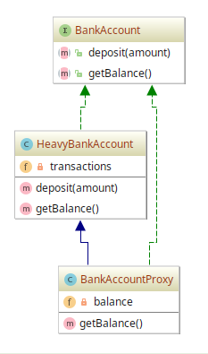

# Proxy example

## Diagram

## Description

A intenção neste padrão é propor uma estrutura para interação com qualquer coisa cara
ou impossível de se duplicar.

Isso pode ser demonstrado numa aplicação de gerenciamento de conta bancária. Podemos
ter uma conta bancária que armazena o **histórico de transações**, sendo muito difícil
com o tempo manter ou criar constantemente uma estrutura que representa a conta bancária
para consultar o **saldo**, por exemplo.

Como forma de amenizar isso, podemos ter um *proxy* chamado **BankAccountProxy** que
irá armazenar o **saldo** já calculado para evitar novas consultas com recálculo com base
em todas as transações feitas.

## Implementation Methodology

* A *Interface* **BankAccount** especifica a assinatura dos métodos que todo conta bancária
tem: `deposit(amount)` e `getBalance()`.

  - Entidade: *Interface* **BankAccount** [BankAccount.php](BankAccount.php)
  
* A *Classe* **HeavyBanckAccount** implementa uma conta bancária com base na interface **BankAccount**.
Também é responsável por armazenar o **historico de transações**.

  - Entidade: *Classe* **HeavyBankAccount** [HeavyBankAccount.php](HeavyBankAccount.php)
  
* A *Classe* **BankAccountProxy** implementa um *proxy*, um mecanismo para intermediar a conta
bancária de forma a fornecer **saldo** previamente calculado.

  - Entidade: *Classe* **BankAccountProxy** [BankAccountProxy.php](BankAccountProxy.php)
