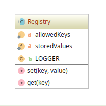

# Registry example

## Diagram

## Description

Este padrão é similar ao **Singleton** (considerado um anti-pattern). A ideia principal é implementar
um local central de armazenamento de objetos usados por toda uma aplicação.

> Importante lembrar que devido à característica de manter um estado global com uso de métodos estáticos,
este padrão pode ser trocado pelo **Dependency Injection**.

## Implementation Methodology

* A *Classe Abstrata* **Registry** especifica com membros estáticos um local de armazenamento global
para toda a aplicação (variável `$storedValues`), além de métodos para obter e salvar objetos nesse local.

  - Entidade: *Classe Abstrata* **Registry** [Registry.php](Registry.php)